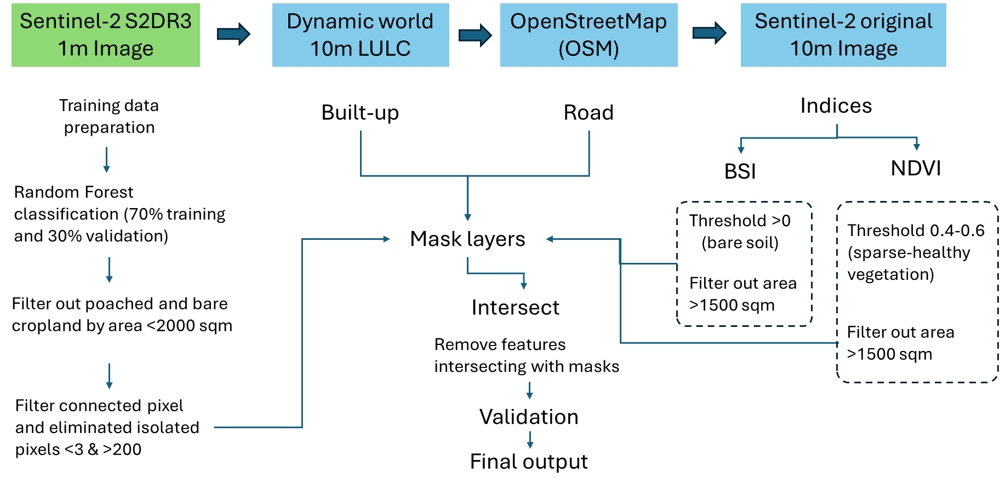
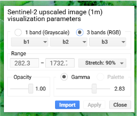
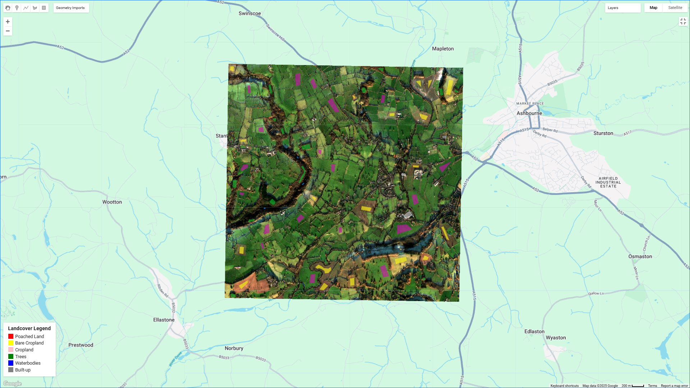
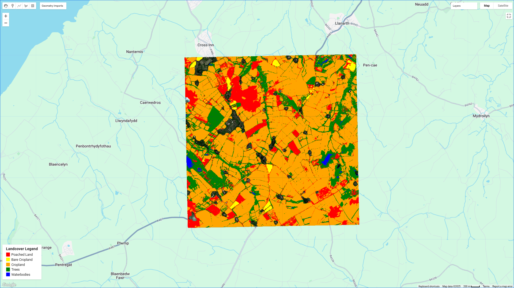

# Open Poached Land Detection Model

## 1. Introduction
Water pollution remains a critical global challenge, affecting a wide range of aquatic environments including rivers, lakes, estuaries, and coastal ecosystems. A significant driver of this issue is non-point source pollution, also known as diffuse pollution, which originates from widespread areas rather than a single, identifiable source. This makes it considerably harder to detect and control compared to point source pollution. One of the main contributors to non-point source pollution is agricultural runoff. 

Poached land is typically defined as ‘the physical breakdown of soil caused by the trampling of livestock’, resulting in soil compaction, vegetation loss, and increased erosion and runoff. However, for the purposes of this work, the term poaching is an all-encompassing word to describe disturbed ground (a potential source of diffuse water pollution), which could be caused by livestock or other activities such as rutting from farm vehicles. This increases their susceptibility to erosion and the leaching of nutrients and chemicals. 

These exposed soils, particularly during periods of heavy rainfall, can rapidly transport sediments, fertilisers, and pesticides into nearby water bodies. As a result, monitoring these areas is essential for identifying potential pollution hotspots and guiding effective mitigation efforts. 

To aid in detecting poached land and help mitigate its environmental impact, a Poached Land Detection Model has been developed that utilises satellite-derived spectral indicators. These indicators help assess key surface characteristics such as bare soil exposure, vegetation density, and the presence of moisture or snow. This capability supports the detection of fallow periods and land degradation, providing valuable insights for sustainable land use and water resource management. 

### 1.1. Motivation
Detecting poached land is valuable for identifying potential sources of water pollution, as these degraded areas often contribute significantly to surface runoff. This runoff can carry harmful substances such as fertiliser-derived nutrients, pesticides, and sediments into nearby water bodies. By pinpointing areas of poached land, it's possible to locate pollution hotspots and implement targeted interventions to reduce water contamination and support environmental sustainability. 

### 1.2. RDMAI Overview
River Deep Mountain AI (RDMAI) is an innovation project funded by the Ofwat Innovation Fund working collaboratively to develop open-source AI/ML models that can inform effective actions to tackle waterbody pollution. The project consists of 6 core partners: Northumbrian Water, Cognizant Ocean, Xylem Inc, Water Research Centre Limited, The Rivers Trust and ADAS. The project is further supported by 4 water companies across the United Kingdom. 

### 1.3. Purpose and Functionality
The primary objective of this project is to develop a novel remote sensing-based model for the detection and monitoring of poached lands, representing areas of degraded soil, primarily due to livestock activities, across agricultural landscapes. This model utilises super resolved Sentinel-2 images created using the S2DR3 algorithm, (Sentinel 2 Deep Resolution 3.0).  This is a deep learning based super resolution model that enhances Sentinel-2 imagery to 1 m resolution. It offers a unique advantage in detecting fine-scale land degradation patterns that are often overlooked by traditional datasets. 

Key functions of the Poached Land Detection Model include:  

- **Identification**: Using 1-meter upscaled S2DR3 imagery to accurately classify poached land, leveraging high-resolution satellite data that provide detailed surface-level information, enabling precise detection of land degradation. 

- **Classification**: Applying a supervised machine learning approach (Random Forest) to distinguish poached land from spectrally similar classes, such as bare soil, cropland, built-up areas, and roads. The classification utilises the rich spectral information from the upscaled imagery to ensure high accuracy in differentiating between these land types. 

- **Preprocessing & Filtering**: To mitigate spectral confusion, the model incorporates a series of preprocessing filters using different indices and GIS layers. 

- **Integration & Export**: The model outputs classification results in formats such as Geo TIFF and Shapefiles, which are fully compatible with widely used GIS platforms, including QGIS and Google Earth Engine, allowing for seamless integration into larger environmental monitoring systems.

This open-source, scalable geospatial pipeline offers an innovative, cost-effective, and dynamic solution for continuous monitoring of poached land, enabling more accurate assessments of land degradation. Unlike traditional field surveys or commercial land use datasets, which are often costly and limited in resolution and frequency, this model utilises freely available, high-resolution satellite imagery, providing real-time insights into agricultural land conditions. 

By improving monitoring capabilities, this model plays a pivotal role in soil erosion risk assessment, sustainable land management, non-point source pollution monitoring, and dynamic land use reporting, thereby supporting informed decision-making in agricultural and environmental resource management. 

## 2. Installation Instructions
The following steps describes how to use the Poached Land Detection Model:

### 2.1.  Prerequisites
- The Poached Land Detection Model is built on the cloud-based Google Earth Engine (GEE) platform, using JavaScript. While local installation of GEE is not required, users must have a valid GEE account and licence to execute the code.  

- Optimised for catchment-level analysis, the model offers efficient pixel-level processing. However, GEE enforces pixel processing limits based on licence type. For standard (free) users, batch tasks are typically restricted to around 1 billion pixels per task, with a maximum of two concurrent batch tasks. Commercial users may access higher limits depending on their subscription plan and quota requests.  

- S2DR3 Upscaled Imagery: This project relies on S2DR3, a 1-meter super-resolved version of Sentinel-2 imagery, as the primary input for classification. The S2DR3 dataset is made available by Gamma Earth Sàrl for testing, performance evaluation, and validation purposes only. For more information, read section [3.1 S2DR3 Upscaled Sentinel-2 Imagery](#31-s2dr3-upscaled-sentinel-2-imagery)
     
### 2.2. Clone the repository
First, clone this project to your local machine or cloud environment  https://github.com/Cognizant-RDMAI/Open-Poached-Land-Detection-Model. This will download all model files including scripts.

### 2.3.  Install dependencies
A valid GEE account is required to run the classification scripts. Access can be requested via https://earthengine.google.com/signup. 
The workflow is designed to be executed within the GEE Code Editor, with parameter adjustments made directly in the script interface (e.g., asset paths, threshold values).

## 3. Dataset and Dependencies
This project integrates multiple geospatial datasets, each serving a specific role in the classification workflow. The following table summariszes the key data sources used:

| Source               | Resolution | Type               | Purpose                          |
|----------------------|------------|--------------------|----------------------------------|
| Sentinel 2           | 10m        | Satellite image    | Calculation of spectral indices [Normalized Difference Vegetation Index (NDVI), Bare Soil Index (BSI)] for filtering vegetation and bare soil     |
| Sentinel 2 (S2DR3)   | 1m         | Satellite image    | Primary input for classification; detailed mapping of poached land and bare soil    |
| Open Street Map (OSM)| Road geometry | Road mask       | Road masking to eliminate model confusion with linear features                 |
| Dynamic world        | 10m        | Landcover dataset    | Filtering built-up areas using landcover masks|
| Google Earth Pro     | ~0.5m       | Historical high-resolution imagery | Visual validation and interpretation support            |

### 3.1 S2DR3 Upscaled Sentinel-2 Imagery

S2DR3 refers to a high-resolution (1-meter) super-resolved version of Sentinel-2 imagery, produced using the Sentinel-2 Deep Resolution 3.0 (S2DR3) model. This model utilises deep learning-based super-resolution techniques to upscale all 12 bands of Sentinel-2 Level-2A data, originally available at 10 m, 20 m, and 60 m, to a unified 1-meter spatial resolution.  

S2DR3 imagery serves as the primary input for classification. Preliminary evaluation was conducted to assess its suitability for detecting poached land, and only images with cloud cover less than 20% were selected for inclusion. In this project, the workflow uses the 10-band composite output provided by S2DR3, in the form of a 4 km × 4 km tile. 

**Note**:  
The S2DR3 model and the upscaled imagery are the intellectual property of Gamma Earth Sàrl. The resources are made available strictly for testing, performance evaluation, and validation purposes.

For extended functionality or commercial use, users are advised to contact the copyright holder directly: info@gamma.earth

Additional licensing details, technical documentation, and terms of use are available in the official [Colab notebook](https://colab.research.google.com/drive/18phbwA1iYG5VDGN2WjK7WrWYi-FdCHJ5#scrollTo=9jeOuDMdnHaZ) 

### 3.2. Sentinel-2 Level-2A Imagery (10 m):

The standard Sentinel-2 Level-2A surface reflectance product at 10-meter resolution is used as a supporting dataset for spectral filtering. Specifically, it is used to compute:
- NDVI (Normalized Difference Vegetation Index) to eliminate cropland and uniformly vegetated regions 
- BSI (Bare Soil Index) to identify and exclude large bare cropland patches 
The imagery is sourced from the COPERNICUS/S2_SR collection on Google Earth Engine. This dataset plays a critical role in pre-classification filtering.

More details of the Sentinel 2 mission can be found here: [Sentinel-2 | Copernicus Data Space Ecosystem](https://dataspace.copernicus.eu/explore-data/data-collections/sentinel-data/sentinel-2) 

### 3.3 Dynamic World Landcover Dataset 

The Dynamic World dataset: [Dynamic World - 10m global land cover dataset in Google Earth Engine](https://www.dynamicworld.app/) is a 10-meter resolution, near-real-time global landcover product developed by Google and the World Resources Institute. In this workflow, it is used to identify and exclude built-up areas from classification results.  

It is sourced from GOOGLE/DYNAMICWORLD/V1 collection on Google Earth Engine 

The Dynamic World layer enhances the robustness of the classification by eliminating false positives in built-up areas where the model may confuse construction zones or impervious surfaces with poached land. 

### 3.4 OpenStreetMap (OSM) Road Geometry 

- Road geometry data are sourced from OpenStreetMap (OSM) and used as a spatial mask to exclude roads from the final poached land vectors.  
- This geometry is subtracted from the poached field polygons to eliminate false positives along linear road segments 
- OSM data are freely available, regularly updated, and easily integrated into Earth Engine or QGIS workflows, making it a practical choice for masking man-made features. 
To download the data use: [Geofabrik Download Server](https://download.geofabrik.de/)

### 3.5 Google Earth Pro Imagery
- High-resolution historical imagery from Google Earth Pro: [Earth Versions – Google Earth](https://www.google.com/intl/en_in/earth/about/versions/) (approximately 0.5 m) is used for visual validation of classification results. It offers finer spatial detail for confirming the presence of poached patches 

- Although not used directly in the processing pipeline, it serves as a valuable reference for interpretation and accuracy assessment. 

## 4. Running the Model & Methodology 

This project follows a multi-stage geospatial workflow to accurately detect poached land areas in agricultural landscapes using high-resolution satellite imagery. The methodology is designed to maximise classification accuracy while minimising false positives from spectrally or spatially similar landcover types such as bare cropland, roads, or built-up areas.  

### 4.1 Input Data Preparation
The classification workflow begins with the preparation and organisation of all required datasets as **Google Earth Engine (GEE) assets**. These assets ensure seamless integration within the processing pipeline and provide spatial consistency across different steps.

All input layers, including imagery, training samples, and filtering masks, were uploaded or accessed as assets within the GEE platform:

**S2DR3 1m 10 Band Composite Tiles** 

For each study location, a Sentinel-2 acquisition date with less than 20% cloud cover was selected. Using this date, the corresponding S2DR3 (Sentinel-2 Deep Resolution 3) upscaled composite was obtained. Each tile spans 4 km × 4 km and includes ten bands upscaled to 1 m spatial resolution. The composite includes the following bands derived from the original 10-m and 20-m resolution bands:

- B2 – Blue 
- B3 – Green 
- B4 – Red 
- B5 – Red Edge 1 
- B6 – Red Edge 2 
- B7 – Red Edge 3 
- B8 – Near Infrared 
- B8A – Vegetation Red Edge 
- B11 – Shortwave Infrared 1 
- B12 – Shortwave Infrared 2

The 60-m resolution bands, B1 (Coastal Aerosol), B9 (Water Vapour), and B10 (Cirrus), are not included in the S2DR3 output. Each tile was uploaded as a .tif asset to the platform for use in the classification workflow. 

**Polygon Training Samples (FeatureCollection)**

 Manually digitised polygons representing five landcover classes:
- Poached land 
- Bare soil 
- Vegetation 
- Built-up land 
- Water bodies

These digitised samples were then compiled into a structured FeatureCollection table where each polygon is associated with a landcover property indicating its class. This table is used directly as the input for training the classifier within Google Earth Engine. 

**Road Geometry Layer (OSM)**

Road data sourced from OpenStreetMap were converted into a vector layer and uploaded as a GEE FeatureCollection. This layer is used as a spatial mask to exclude road features from the classification output. The detailed workflow is provided in INSTALL.md

**Built-up Mask (Dynamic World)**

The **Dynamic World landcover dataset** was accessed directly within Google Earth Engine (GEE). Class 6 from the dataset, representing built-up areas (including impervious surfaces), was isolated and used to generate a built-up mask. This mask was applied during the refinement stage of the classification workflow to reduce false positives within urban zones.

### 4.2 Classification workflow 
The core classification process is built around a **supervised Random Forest classifier**, trained on polygon-based labelled samples and applied to high-resolution **S2DR3 (1m)** imagery.

#### Step 1: Loading and Visualising Input Imagery 

- The S2DR3 upscaled image is used as the main classification input and centred on the study area. 
- A Sentinel-2 10-m (same date) true colour composite is also prepared for reference and to support spectral index calculations (e.g., NDVI, BSI) 

#### Note for users: 
When loading the **S2DR3 upscaled image (1 m)** into Google Earth Engine, ensure the following visualisation parameters are set for proper display:
- Display mode: 3 bands (RGB) 
- Bands: b1 (Blue), b2 (Green), b3 (Red) 
- Stretch: 90% 

These settings enhance the visual clarity of surface features and should be applied before inspecting or labelling data.

Fig. 2: Visualisation settings example

#### Step 2: Masking Built-up Areas Using Dynamic World 

- The Dynamic World landcover dataset is filtered for the same area and year. 
- Pixels labelled as built-up (class 6) are masked from the S2DR3 image to eliminate built-up area and impervious surfaces during training and classification.

#### Step 3: Preparing Training Samples 
Samples representing five classes are loaded from the **pre-prepared FeatureCollection** asset, with the following landcover values assigned are taken to serve as input for the classification 
- 0 – Poached Land 
- 1 – Bare Cropland 
- 2 – Cropland 
- 3 – Trees 
- 4 – Waterbodies

Fig 3: Training Samples 

#### Step 4: Train-Test Splitting
- The training samples are randomly split: 
- 70% for training 
- 30% for testing/validation (optional for further evaluation) 

#### Step 5: Training Random Forest Classifier 

- A Random Forest model with 50 trees is trained using the training set. 
- All available bands from the S2DR3 image are used as input features.

#### Step 6: Classifying the Image 

- The trained model is applied to the entire S2DR3 image to generate a classified map. 
- Each pixel is assigned a class label (0–4) based on its spectral similarity to training data.

Fig. 3. Classification output sample 

#### Step 7: Extract Key Classes for Further Processing
Two classes are extracted for downstream refinement:
- Poached Land (Class 0) 
- Bare Cropland (Class 1)

#### Note: 
Initial classification results revealed that **bare cropland** areas were frequently misclassified as poached land. This is primarily due to spectral similarity, as both exhibit exposed soil surfaces and lack strong vegetation signals. 

To address this, a **three-stage post-classification refinement process** was implemented, combining spatial filters, spectral index-based masks, and contextual exclusion of roads and built-up areas. 

### 4.3 Post- Classification Filtering and Refinement 
The output undergoes a three-stage spatial and spectral filtering process. These refinement steps are designed to reduce false positives and isolate high confidence poached land features. 

#### Stage 1: Area and Connectivity Filtering
- Vectorised poached land and bare cropland classes were filtered to retain only polygons with an area less than 2000 m². 
- These smaller features were rasterised and subjected to connected pixel analysis, keeping only spatially coherent clusters between 3 and 200 pixels. 
- This step helps eliminate scattered or fragmented misclassifications that do not represent meaningful land features. 

#### Stage 2: Spectral Filtering (NDVI & BSI) 
- Bare Soil Index (BSI) was calculated to identify and remove large patches of exposed bare soil (>1500 m²) that could be confused with poached land. 
- NDVI was used to filter out zones of uniform cropland by masking areas with NDVI values between 0.4 and 0.6 and an area greater than 1500 m².
- These spectral filters help distinguish poached land from similar-looking agricultural or natural surfaces. 

#### Stage 3: Road and Built-up Area Masking

- All road geometries from OpenStreetMap were merged and subtracted from the candidate poached field polygons to remove features overlapping with roads.  
- Built-up areas were already excluded earlier using the Dynamic World landcover dataset, ensuring no overlap with urban structures.  
- The result is a cleaned and high-confidence layer of poached land detections, ready for export or integration into GIS platforms for further analysis.  

## 5. Model Evaluation 
The performance of the poached land classification model was evaluated using a combination of **visual interpretation** and **reference-based validation** across multiple test sites.

- Known locations of **poached** and **non-poached land** were first **manually** identified using Google Earth Pro high-resolution imagery. 

- Ground-truth labels were assigned based on visible indicators such as: 

- Soil exposure 

- Vegetation loss 

- Presence of hoof marks 

- These visually identified locations were **cross verified in S2DR3 upscaled imagery** to ensure that the corresponding spectral patterns were distinguishable and suitable for model learning. 
- Only sites that satisfied both **visual** and **spectral distinctiveness** were used as valid ground-truth points. 
- In addition, **reference sites shared by Domain Experts** were used to guide interpretation and maintain consistency across samples.

The model was evaluated across **10 different imagery tiles**, each representing distinct geographic and spectral conditions. For each tile, standard classification metrics were computed: 

| Image   | Accuracy (%) | Precision (%) | Recall (%) | F1 Score (%) |
|---------|--------------|----------------|-------------|---------------|
| Image 1 | 65.10        | 63.22          | 61.11       | 62.15         |
| Image 2 | 44.68        | 41.94          | 27.66       | 33.33         |
| Image 3 | 53.70        | 54.55          | 44.44       | 48.98         |
| Image 4 | 74.00        | 73.08          | 76.00       | 74.51         |
| Image 5 | 69.72        | 68.42          | 73.24       | 70.75         |
| Image 6 | 64.12        | 67.14          | 55.29       | 60.65         |
| Image 7 | 58.64        | 60.00          | 48.75       | 53.79         |
| Image 8 | 62.73        | 63.16          | 60.00       | 61.54         |
| Image 9 | 65.50        | 63.48          | 73.00       | 67.91         |
| Image 10| 87.44        | 74.19          | 57.50       | 64.79         |

On average, the model achieved an overall accuracy of 65.7%, with a precision of 62.2%, recall of 59.3%, and F1 score of 60.7%. 

## 6. Conclusions 
This study presents a scalable and semi-automated workflow for detecting poached land using high-resolution S2DR3 upscaled Sentinel-2 imagery within the Google Earth Engine environment. The approach combines supervised classification with post-classification spatial and spectral filtering to improve accuracy in complex agricultural landscapes. 

### 6.1 Key highlights of the work
- Use of 1-meter super-resolved S2DR3 imagery, allowing the detection of fine-scale degradation patterns not visible in standard 10-m imagery.  
- Integration of multiple filters (NDVI, BSI, road and built-up masks) to reduce false positives arising from spectral similarity with bare cropland and infrastructure. 

The workflow demonstrates the potential of combining upscaled satellite data with cloud-based geospatial processing for environmental monitoring. With further refinement and the inclusion of larger training datasets, this approach can be extended to support broader land degradation assessments, pasture management, and agri-environmental policy planning. 

### 6.2 Strengths
- Combines S2DR3 (1-m) imagery for detailed classification with Sentinel-2 (10-m) data for contextual filtering using NDVI and BSI. 
- Incorporates OSM roads and Dynamic World built-up masks to reduce false positives in urban and linear features. 
- Area and connectivity filters enhance spatial coherence, removing small or isolated patches. 
- Achieves consistent performance across crop-dominated areas with an average accuracy of 65.7% and F1 score of 60.7%. 
- Fully implemented in Google Earth Engine, enabling scalable, cloud-based processing. 

### 6.3 Limitations

- The commercial use of S2DR3 is governed by applicable licensing terms and conditions, including associated costs.  
- A recall rate of 59.3% reflects missed detections across multiple poached areas. 
- Performance declines in heterogeneous landscapes (areas where rangeland, semi-urban, and agricultural settings coexist) due to spectral confusion. 
- Thresholds are currently set manually based on initial image analysis, which may limit effectiveness in certain geographic conditions and hinder generalisation across different regions or seasons. 
- May require retraining or adjustment when applied to new geographies or imagery types.

### 6.4 Future Enhancements 

- Expand Input Data Sources: Using satellite imagery of sub-meter resolution (where cost permits) could improve classification accuracy and simplify the multi-step refinement process. 
- Validation Expansion: Collecting more ground truth points across different soil types, geographies, and land-use patterns would help improve calibration.  
- Scalability Testing: Applying the model to larger or different catchments to assess generalisation potential. 

## 7.  Disclaimer

River Deep Mountain AI (“RDMAI”) consists of 10 parties. The parties currently participating in RDMAI are listed at the end of this section and they are collectively referred to in these terms as the “consortium”. 

This section provides additional context and usage guidance specific to the artificial intelligence models and / or software (the “Software”) distributed under the MIT License. It does not modify or override the terms of the MIT License. In the event of any conflict between this section and the terms of the MIT licence, the terms of the MIT licence shall take precedence.

### 7.1 Research and Development Status 
The Software has been created as part of a research and development project and reflects a point-in-time snapshot of an evolving project. It is provided without any warranty, representation or commitment of any kind including with regards to title, non-infringement, accuracy, completeness, or performance. The Software is for information purposes only and it is not: (1) intended for production use unless the user accepts full liability for its use of the Software and independently validates that the Software is appropriate for its required use; and / or (2) intended to be the basis of making any decision without independent validation. No party, including any member of the development consortium, is obligated to provide updates, maintenance, or support in relation to the Software and / or any associated documentation.  

### 7.2 Software Knowledge Cutoff 
The Software was trained on publicly available data up to April 2025. It may not reflect current scientific understanding, environmental conditions, or regulatory standards. Users are solely responsible for verifying the accuracy, timeliness, and applicability of any outputs.

### 7.3 Experimental and Generative Nature 
The Software may exhibit limitations, including but not limited to: 
- Inaccurate, incomplete, or misleading outputs; 
- Embedded biases and / or assumptions in training data; 
- Non-deterministic and / or unexpected behaviour; 
- Limited transparency in model logic or decision-making 

Users must critically evaluate and independently validate all outputs and exercise independent scientific, legal, and technical judgment when using the Software and / or any outputs. The Software is not a substitute for professional expertise and / or regulatory compliance. 

### 7.4 Usage Considerations 

- Bias and Fairness: The Software may reflect biases present in its training data. Users are responsible for identifying and mitigating such biases in their applications. 

- Ethical and Lawful Use: The Software is intended solely for lawful, ethical, and development purposes. It must not be used in any way that could result in harm to individuals, communities, and / or the environment, or in any way that violates applicable laws and / or regulations. 

- Data Privacy: The Software was trained on publicly available datasets. Users must ensure compliance with all applicable data privacy laws and licensing terms when using the Software in any way. 

- Environmental and Regulatory Risk: Users are not permitted to use the Software for environmental monitoring, regulatory reporting, or decision making in relation to public health, public policy and / or commercial matters. Any such use is in violation of these terms and at the user’s sole risk and discretion. 

### 7.5 No Liability
This section is intended to clarify, and not to limit or modify, the disclaimer of warranties and limitation of liability already provided under the MIT License.
- To the extent permitted by applicable law, users acknowledge and agree that: 
The Software is not permitted for use in environmental monitoring, regulatory compliance, or decision making in relation to public health, public policy and / or commercial matters. 
- Any use of the Software in such contexts is in violation of these terms and undertaken entirely at the user’s own risk. 
- The development consortium and all consortium members, contributors and their affiliates expressly disclaim any responsibility or liability for any use of the Software including (but not limited to).
- Environmental, ecological, public health, public policy or commercial outcomes 
- Regulatory and / or legal compliance failures 
- Misinterpretation, misuse, or reliance on the Software’s outputs 
- Any direct, indirect, incidental, or consequential damages arising from use of the Software including (but not limited to) any (1) loss of profit, (2) loss of use, (3) loss of income, (4) loss of production or accruals, (5) loss of anticipated savings, (6) loss of business or contracts, (7) loss or depletion of goodwill, (8) loss of goods, (9) loss or corruption of data, information, or software, (10) pure economic loss, or (11) wasted expenditure resulting from use of the Software —whether arising in contract, tort, or otherwise, even if foreseeable.
Users assume full responsibility for their use of the Software, validating the Software’s outputs and for any decisions and / or actions taken based on their use of the Software and / or its outputs.

### 7.6 Consortium Members
- Northumbrian Water Limited 
- Cognizant Worldwide Limited 
- Xylem 
- Water Research Centre Limited 
- RSK ADAS Limited 
- The Rivers Trust 
- Wessex Water Limited 
- Northern Ireland Water 
- Southwest Water Limited 
- Anglian Water Services Limited

## 8. References 
1. Bilotta, G. S., Brazier, R. E., & Haygarth, P. M. (2007). The impacts of grazing animals on the quality of soils, vegetation, and surface waters in intensively managed grasslands. Advances in Agronomy, 94, 237–280. 

2. Parulekar, B., Singh, N., & Ramiya, A. M. (2024). Evaluation of Segment Anything Model (SAM) for automated labelling in machine learning classification of UAV geospatial data. Earth Science Informatics, 17, 4407–4418. https://link.springer.com/article/10.1007/s12145-024-01402-7. 

3. Trujillano, F., Jimenez, G., Manrique, E., Kahamba, N. F., Okumu, F., Apollinaire, N., Carrasco-Escobar, G., Barrett, B., & Fornace, K. (2024). Using image segmentation models to analyse high-resolution earth observation data: new tools to monitor disease risks in changing environments. International Journal of Health Geographics. DOI: 10.1186/s12942-024-00371-w. 

4. Zhang, Y., Collins, A. L., & Winter, M. (2022). Tackling unintended consequences of grazing livestock farming: Multi-scale assessment of co-benefits and trade-offs for water pollution mitigation scenarios. Science of the Total Environment, 838, 156021. https://doi.org/10.1016/j.scitotenv.2022.156021. 

5. Greenwood, P., & Meusburger, K. (2018). Documenting soil redistribution on livestock-poached pasture using caesium-134 and cobalt-60 as tracers. Land Degradation & Development. https://doi.org/10.1002/ldr.3226. 

6. Ayhan, B., Kwan, C., Budavari, B., Kwan, L., Lu, Y., Perez, D., Li, J., Skarlatos, D., & Vlachos, M. (2020). Vegetation Detection Using Deep Learning and Conventional Methods. Remote Sensing, 12(15), 2502. https://doi.org/10.3390/rs12152502. 

7. Li, B., Wang, H., Qin, M., & Zhang, P. (2017). Comparative study on the correlations between NDVI, NDMI and LST. Progress in Geography, 36(5), 585–596. https://doi.org/10.18306/dlkxjz.2017.05.006. 

8. Kamminga, J., Ayele, E., Meratnia, N., & Havinga, P. (2018). Poaching Detection Technologies - A Survey. Sensors, 18(5), 1474. https://doi.org/10.3390/s18051474.

9. Yosef Akhtman, S2DR3: Effective 10-Band 10x Single Image Super-Resolution for Sentinel-2. Medium: https://medium.com/@ya_71389/c71a601a2253

 

